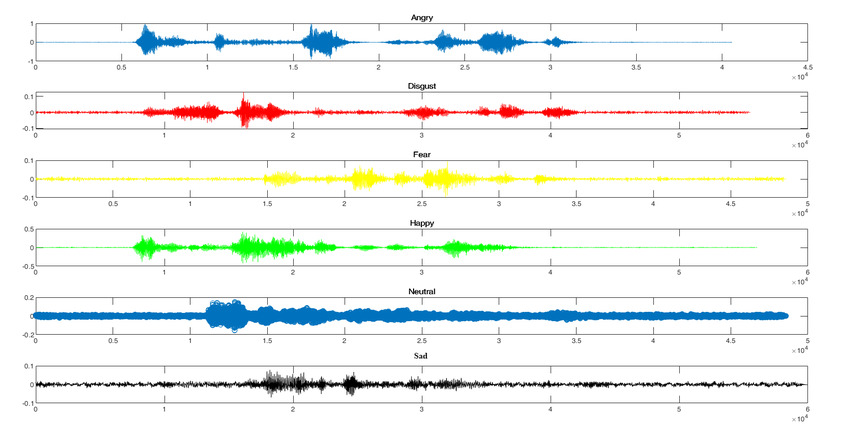

# Speech Emotion Recognition

This project is an attempt at the speech emotion recognition (SER) task on the [CREMA dataset](https://www.kaggle.com/datasets/ejlok1/cremad) using a slightly modified implementation of the RCNN 1D & 2D architectures mentioned in the paper [Zhao, Jianfeng & Mao, Xia & Chen, Lijiang. (2019). Speech emotion recognition using deep 1D & 2D CNN LSTM networks. Biomedical Signal Processing and Control. 47. 312-323. 10.1016/j.bspc.2018.08.035.](https://www.sciencedirect.com/science/article/abs/pii/S1746809418302337). The time domain (1D) features zero-crossing rate and root mean square error, along with the frequency domain mel spectrogram, are used as input to the neural networks. TensorFlow was used in the building of the 1D & 2D models.



This project was developed as part of the course Pattern Recognition in the Spring 2023 semester at the Faculty of Engineering, Alexandria University, under the Computer and Communications Engineering department, supervised by Dr. Marwan Torki.

## Steps

1- Download the dataset and understand the format.

2- Create the feature space.

3- Build the models.

4- Compare between the performance of the learned models.

## Prerequisites

This project was developed in the following environment:

- Jupyter Notebook
- Miniconda
- Python 3.11.5

## Installing

1- Clone the repository to your local machine:

```bash
git clone https://github.com/MohEsmail143/speech-emotion-recognition.git
```

2- Open Jupyter notebook.

3- Check out the the Jupyter notebook `speech-emotion-recognition.ipynb`.

## License

This project is licensed under the MIT License - see the [LICENSE.md](LICENSE) file for details.
